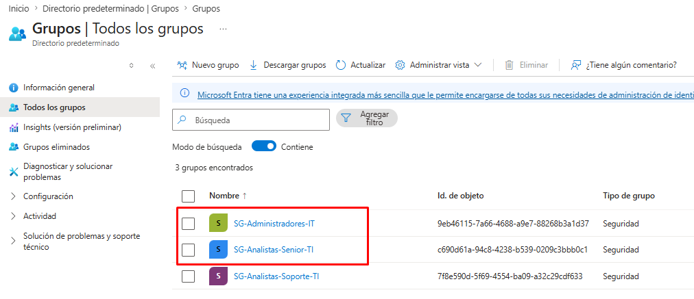

# Matriz RBAC — Roles y niveles de acceso

## Objetivo

Diseñar y documentar una matriz de control de acceso basado en roles (RBAC — *Role-Based Access Control*) que defina niveles de acceso progresivos para un área de TI/Seguridad, aplicando el principio de menor privilegio: cada usuario recibe únicamente los permisos necesarios para cumplir su función, ni más ni menos.

## Roles definidos

Se crearon 3 grupos de seguridad en Microsoft Entra ID, cada uno representando un nivel de responsabilidad dentro del área:

| Grupo de seguridad | Nivel | Descripción |
|---|---|---|
| **SG-Analistas-Soporte-TI** | Nivel 1 | Soporte operativo básico — primera línea de atención |
| **SG-Analistas-Senior-TI** | Nivel 2 | Soporte avanzado — gestión de cuentas y accesos |
| **SG-Administradores-IT** | Nivel 3 | Administración completa — gobierno de identidades y seguridad |

## Matriz de permisos

| Recurso / Permiso | Nivel 1 (Soporte) | Nivel 2 (Senior) | Nivel 3 (Admin) |
|---|---|---|---|
| Restablecer contraseñas de usuario estándar | ✅ | ✅ | ✅ |
| Desbloquear cuentas de usuario | ✅ | ✅ | ✅ |
| Crear/deshabilitar cuentas de usuario | ❌ | ✅ | ✅ |
| Gestionar membresía de grupos de seguridad | ❌ | ✅ | ✅ |
| Asignar licencias | ❌ | ✅ | ✅ |
| Acceso a registros de auditoría | ❌ | ✅ | ✅ |
| Crear/modificar políticas de Conditional Access | ❌ | ❌ | ✅ |
| Administrar roles de administrador global | ❌ | ❌ | ✅ |

## Justificación técnica

- **Menor privilegio progresivo:** cada nivel hereda conceptualmente las capacidades del nivel anterior y suma responsabilidades adicionales, en lugar de que cada rol tenga un conjunto de permisos completamente aislado. Esto refleja cómo evoluciona la responsabilidad real en un equipo de TI: un analista senior puede hacer todo lo que hace uno junior, más funciones adicionales de gestión.

- **Separación entre operación y gobierno:** los permisos más sensibles (modificar Conditional Access, administrar roles de administrador global) se reservan exclusivamente para el Nivel 3. Esto limita la superficie de exposición: si una cuenta de Nivel 1 o 2 se ve comprometida, el atacante no puede alterar las políticas de seguridad del tenant ni escalar privilegios administrativos.

- **Grupos de seguridad como unidad de gestión:** en lugar de asignar permisos directamente a usuarios individuales, los permisos se administran a nivel de grupo. Un cambio de rol de un colaborador (como el simulado en el ciclo ABM) se traduce en un cambio de membresía de grupo, no en una reconfiguración manual de permisos uno por uno.

- **Auditabilidad:** con esta estructura, responder "¿quién puede modificar políticas de seguridad?" es tan simple como revisar la membresía de `SG-Administradores-IT`, en lugar de auditar permisos individuales de cada usuario del tenant.

## Evidencia

## Próximos pasos

- Asignar roles de Microsoft Entra ID (ej. Helpdesk Administrator, User Administrator) a los grupos correspondientes para que los permisos de la matriz se apliquen técnicamente, no solo de forma documental
- Documentar el siguiente escenario: configuración de métodos de autenticación multifactor (`04-mfa-enforcement`)
